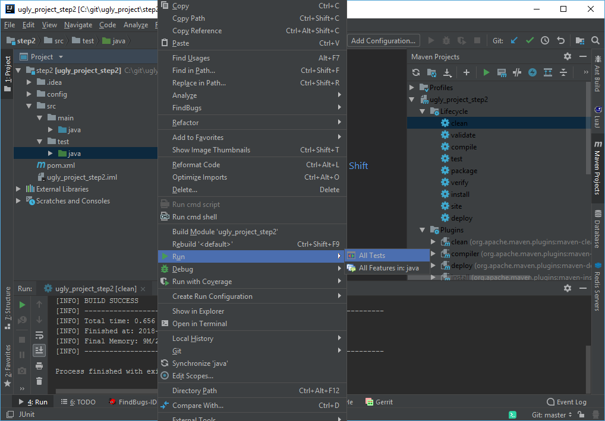

# Übung 2 Intellij + Check Style + Java Docs + JUnit

# Voraussetzung:
* GIT 
* Java JDK installiert + JAVA_HOME gesetzt
* Idea Intellij
* [PatrikSteuer/ugly_project](https://github.com/PatrikSteuer/ugly_project) ausgecheckt
* Step2 des ugly_projects als IDEA Intellij Projekt geöffnet

### Site + Junit
Erstellen Sie einen Maven Report über ihr aktuelles Projekt. 
* Dazu müssen Sie die Lifecycle package und site ausführen
* Dann können Sie sich target/site/jacoco/index.html anschauen
* Schauen Sie welche Methoden der Klasse MathFunctions noch nicht getestet sind. 
* Erstellen Sie zusätzliche Tests sodass alle Methoden getestet werden

### JUnit und Intellij
Sie können ihre JUnit tests auch direkt in Intellij ausführen. 
1. Gehen Sie dafür auf *src>test>java*. 
2. Rechtsklick auf *java*
3. *Run>All Tests*

Das gleiche können Sie auch im Debug Modus machen um Fehler zu analysieren finden. Zudem können Sie so auch einfach einzelne Tests laufen lassen.

### Code Style
Importieren Sie die Settings zur Code Formatierung in Ihre IDE.
1. Öffnen Sie die Settings *STRG+ALT+S*
2. Editor > Code Style 
3. Klicken Sie auf  *Import Scheme > Intellij IDEA code style xml*
4. Klicken Sie auf Ok, Sie sollten nun GoogleStyle als Scheme ausgewählt haben. 
5. Klicken Sie auf Ok

### Checkstyle + Java Docs
* Schauen Sie sich den Checkstyle report in site/checkstyle.html an
* Beheben Sie die Fehler der MathFunctions Klasse, DesignForExtension können ignoriert werden

